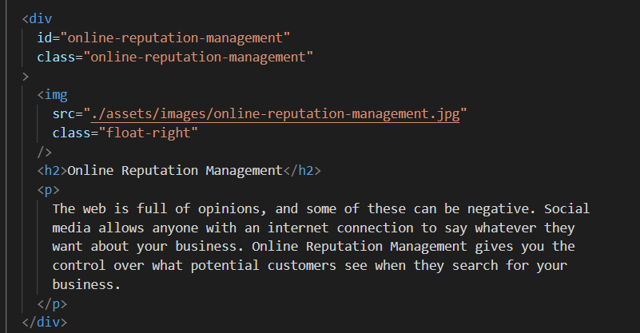
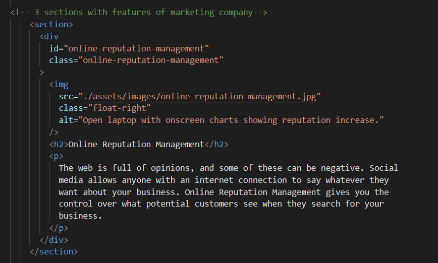
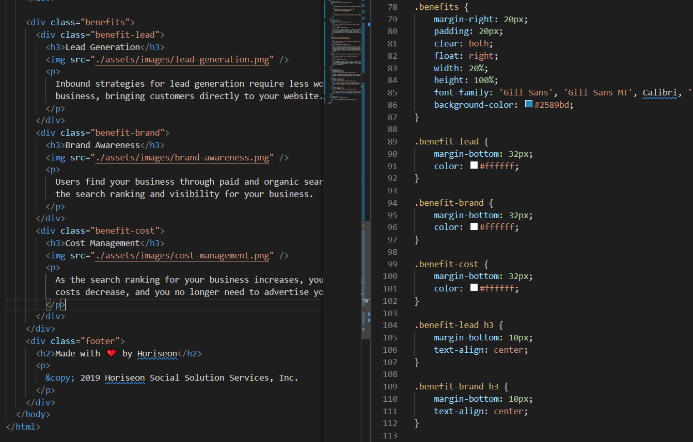
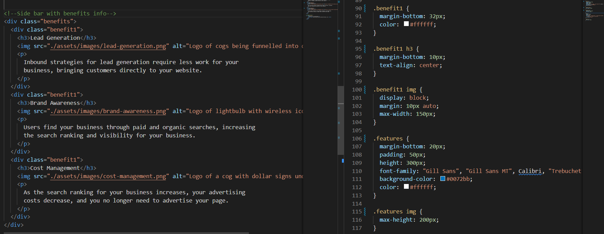
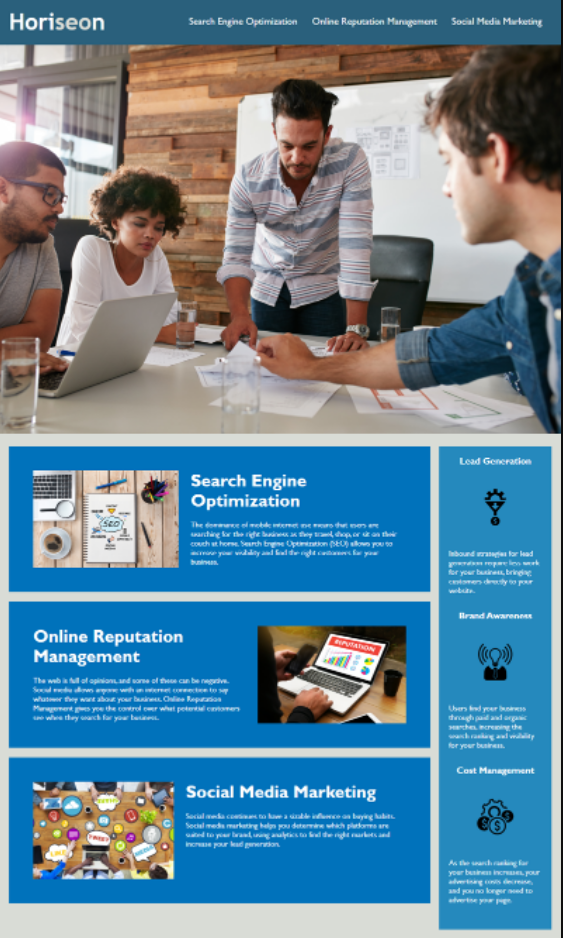

# Marketing-Agency

## Project Summary

This project is **refactoring code** for a marketing agency who want it's webpage to be updated to improve both **accessibility** and **search engine optimization**.
 
 

## Details of Refactored Code:

1. Semantic HTML codes added.
2. Elements now follow a logical structure. independent of styling and positioning.
3. Accessible alt attributes added to icons and image elements.
4. Headings now fall in sequential order.
5. Broken link fixed.
6. Duplicate css streamlined and changes made to HTMl accordingly.
7. Title element is concise and descriptive.
8. Comments added to aid code maintenance.  
    

## Screenshots

  
Original HTML code snippet

<em>Code without alt text and with no syntax elements.</em>

 
 

Refactored HTML code snippet

<em>   Refactored code with alt text for accessibility and semantic elements for better SEO.</em>
 
 

Original duplicate css code and corresponding HTML elements

<em>Original css has duplicate class names with similar properties</em>
 
 

Refactored css code and corresponding HTML elements

<em>Refactored code has reduced class names which have the same properties and corresponding changes have been made in html </em>
 
 

Original webpage document image

 

Refactored webpage document image

 

## Links

https://nsharma-uk.github.io/marketing-agency/
 
 
https://github.com/nsharma-uk/marketing-agency/tree/dev
 
 

## Authored by

Original code - unknown
 
Refactored code - N Sharma
 
 

## Contact

GitHub: github.com/nsharma-uk  
Twitter: @NSharmaUK

