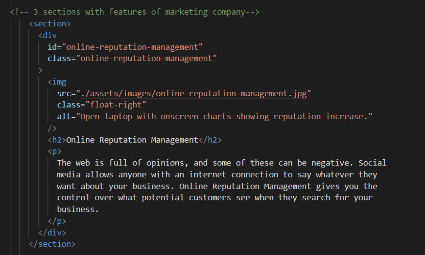

# marketing-agency refactor

## Summary

This project is refactoring code for a marketing agency who want it's webpage to be updated to improve both accessibility and search engine optimization.
<br>
<br>

## Screenshots

<details>
  <summary>Original HTML code snippet</summary>


</details>

<br>

<details>

<summary>Refactored HTML code snippets</summary>


</details>

<br>

<em>Refactoring includes: adding sections and alt texts for greater accessibility and SEO</em>
<br>
<br>

<details>

  <summary>Original CSS code</summary>


</details>
<br>

<details>

  <summary>Refactored CSS code</summary>


<em>

</details>

## User Story

```
AS A marketing agency
I WANT a codebase that follows accessibility standards
SO THAT our own site is optimized for search engines
```

## Acceptance Criteria

```
GIVEN a webpage meets accessibility standards
WHEN I view the source code
THEN I find semantic HTML elements
WHEN I view the structure of the HTML elements
THEN I find that the elements follow a logical structure independent of styling and positioning
WHEN I view the icon and image elements
THEN I find accessible alt attributes
WHEN I view the heading attributes
THEN they fall in sequential order
WHEN I view the title element
THEN I find a concise, descriptive title
```
